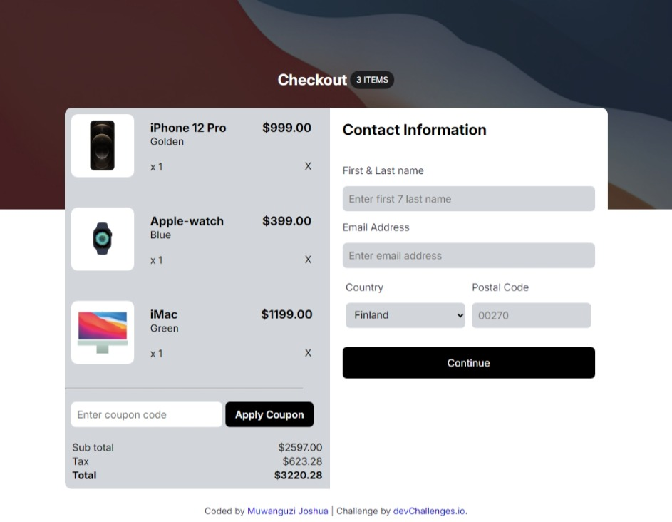

<!-- Please update value in the {}  -->

<h1 align="center">{Your project name} | devChallenges</h1>

   Solution for a challenge <a href="https://devchallenges.io/challenge/apple-shop-checkout-page-challenge" target="_blank">Device Shop Checkout</a> from <a href="http://devchallenges.io" target="_blank">devChallenges.io</a>.

  <h3>
    <a href="{https://your-demo-link.your-domain}">
      Demo
    </a>
     | 
    <a href="{https://your-url-to-the-solution}">
      Solution
    </a>
     | 
    <a href="https://devchallenges.io/challenge/apple-shop-checkout-page-challenge">
      Challenge
    </a>
  </h3>

<!-- TABLE OF CONTENTS -->

## Table of Contents

- [Overview](#overview)
  - [What I learned](#what-i-learned)
  - [Useful resources](#useful-resources)
- [Built with](#built-with)
- [Features](#features)
- [Contact](#contact)
- [Acknowledgements](#acknowledgements)

<!-- OVERVIEW -->

## Overview
This challenge is to design a Chart checkout page by devchallenges.io. it has been a good challenge to test my HTML , CSS skills with applying responsivenesss. though i managed to accomplish the challenge, i met some obstacles like my lack of knowledge to use media queries, but i tried maybe for the future i will improve  in it.

### What I learned

I have applied media queries as it is my first time to use them, though much roo to improve in using them

### Useful resources
[W3 Schools](https://www.w3schools.com/cssref/atrule_media.php)
[CSS tricks](https://css-tricks.com/a-complete-guide-to-css-media-queries/)

### Built with

- Semantic HTML5 markup
- CSS custom properties
- Flexbox

## Features

This application/site was created as a submission to a [DevChallenges](https://devchallenges.io/challenges-dashboard) challenge.

## Author

- GitHub [@jmuwan](https://{github.com/jmuwan})
